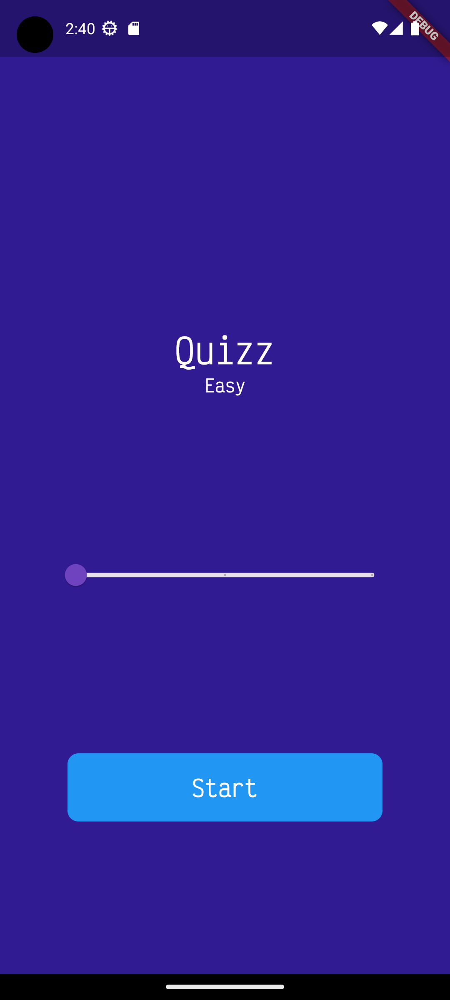
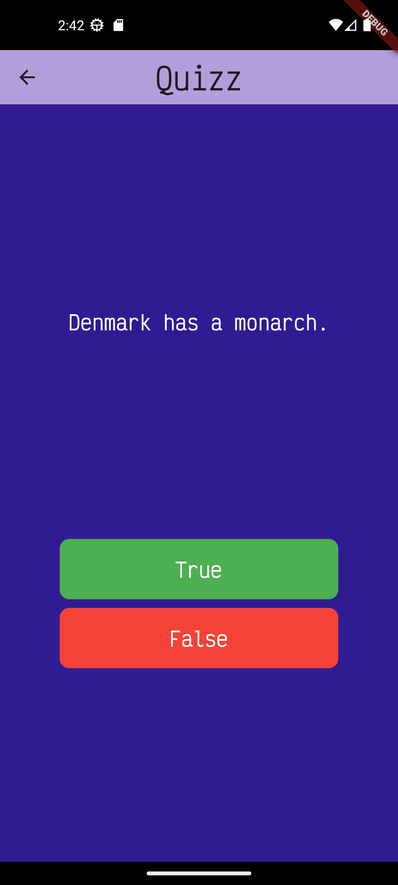

# Quizz

A trivia of ten questions per session. The questions are fetched from an API and the user can select the difficulty level of the questions.

### Project details

- API used is <a href="https://opentdb.com/api_config.php">Open Trivia Database</a>.
- Used <a href="">Provider</a> for state management.
- Used <a href="">dio</a> for http client.
- Used <a href="">Get_it</a> to create a singleton instance of a service class.

### Screenshots

 &nbsp;&nbsp;&nbsp;&nbsp;&nbsp;&nbsp;&nbsp;&nbsp;&nbsp;&nbsp;&nbsp;&nbsp;&nbsp;&nbsp;

### To use the provider package

- Setup the **ChangeNotifier** class by extending **ChangeNotifier**, this holds the state data and methods to modify the state.
- To use setState inside a **ChangeNotifier**, define it within the class as  
  <code>
  void setState(VoidCallback callback) {
  callback();  
  notifyListeners();  
  }
  </code>
- Setup the **ChangeNofitierProvider** to enable state for the screen needed.
- It is possible to Consume the state data in the **ChangeNotifierProvider** using **Consumer**
- Consume it like so:
  <code>  
  Consumer<StartPageProvider>(  
  &nbsp; builder: (context, provider, child) {  
  &nbsp; return gameTitle(
  deviceHeight, deviceWidth, provider.difficulty);
    },)
  </code>
